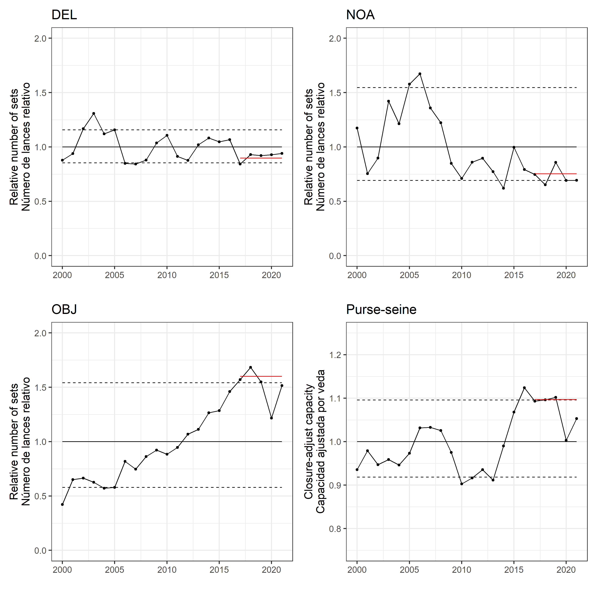
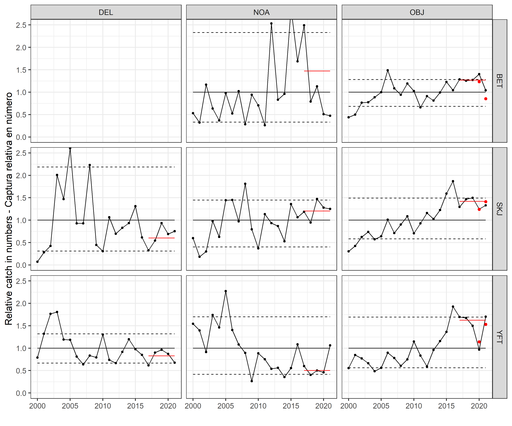
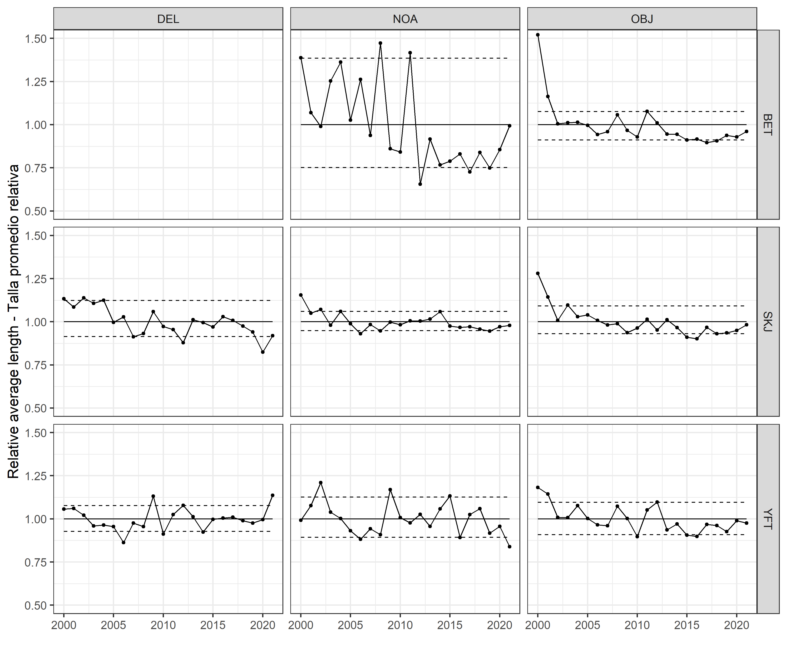
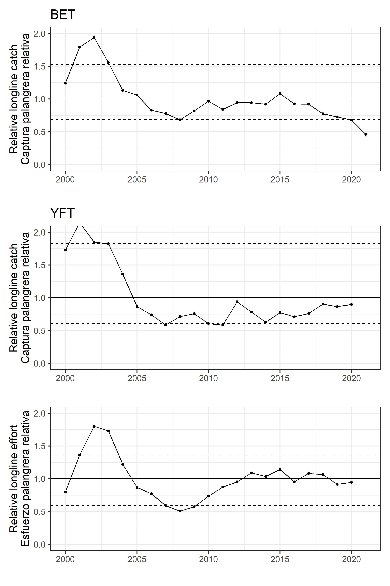
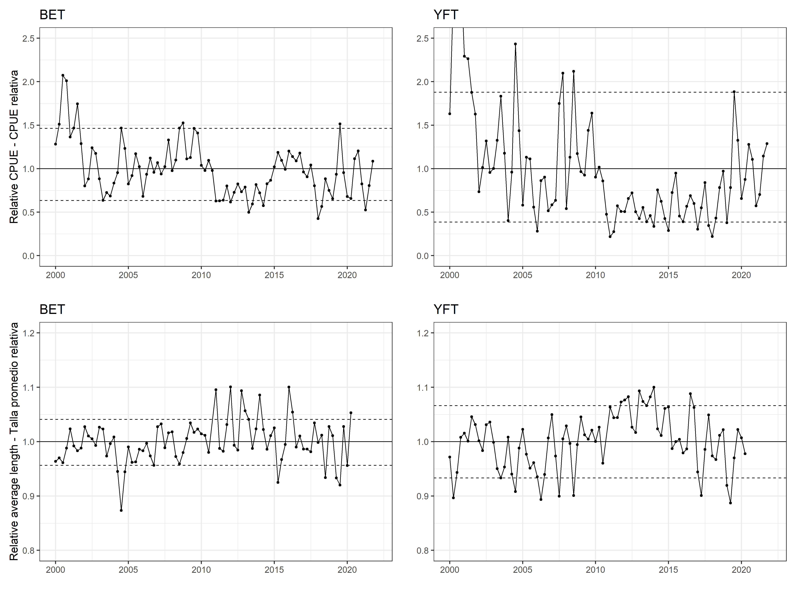

```{r setup, include = FALSE}
year <- 2022
knitr::opts_chunk$set(echo = FALSE, warning = FALSE, message = FALSE)
```

```{r load library}
# dir <- paste0("D:/OneDrive - IATTC/Git/Indicators/",year,"/")
# setwd(dir)

library(tidyverse)
library(knitr)
library(patchwork)
```

```{r Figure 1a}
Figure1 <- "data/"
# table is from A7 in the FSR

A71 <- read.csv(paste0(Figure1,"A7_old.csv"))
A72 <- read.csv(paste0(Figure1,"A7.csv"))

A7 <- rbind(A71,A72) %>%
  gather(4:6,key="Species",value="Catch") %>%
  group_by(Type) %>%
  mutate(NSets = as.numeric(NSets),
         NSets2=NSets/mean(NSets))

DEL_low <- quantile(A7$NSets2[which(A7$Type=="DEL")],0.1)
DEL_high <- quantile(A7$NSets2[which(A7$Type=="DEL")],0.9)

f1a <- ggplot(data=A7 %>% filter(Type=="DEL")) +
  geom_line(aes(x=Year,y=NSets2)) +
  geom_point(aes(x=Year,y=NSets2)) +
  xlab("") + ylab("Relative number of sets") +
  theme_bw(16) +
  geom_hline(yintercept = DEL_low, linetype = "dashed") +
  geom_hline(yintercept = DEL_high, linetype = "dashed") +
  geom_hline(yintercept = 1) +
  coord_cartesian(ylim = c(0,2)) + ggtitle("DEL")
```

```{r Figure 1b}
NOA_low <- quantile(A7$NSets2[which(A7$Type=="NOA")],0.1)
NOA_high <- quantile(A7$NSets2[which(A7$Type=="NOA")],0.9)

f1b <- ggplot(data=A7 %>% filter(Type=="NOA")) +
  geom_line(aes(x=Year,y=NSets2)) +
  geom_point(aes(x=Year,y=NSets2)) +
  xlab("") + ylab("Relative number of sets") +
  theme_bw(16) +
  geom_hline(yintercept = NOA_low, linetype = "dashed") +
  geom_hline(yintercept = NOA_high, linetype = "dashed") +
  geom_hline(yintercept = 1) +
  coord_cartesian(ylim = c(0,2)) + ggtitle("NOA")
```

```{r Figure 1c}
OBJ_low <- quantile(A7$NSets2[which(A7$Type=="OBJ")],0.1)
OBJ_high <- quantile(A7$NSets2[which(A7$Type=="OBJ")],0.9)

f1c <- ggplot(data=A7 %>% filter(Type=="OBJ")) +
  geom_line(aes(x=Year,y=NSets2)) +
  geom_point(aes(x=Year,y=NSets2)) +
  xlab("") + ylab("Relative number of sets") +
  theme_bw(16) +
  geom_hline(yintercept = OBJ_low, linetype = "dashed") +
  geom_hline(yintercept = OBJ_high, linetype = "dashed") +
  geom_hline(yintercept = 1) +
  coord_cartesian(ylim = c(0,2)) + ggtitle("OBJ")
```

```{r Figure 1d}
A10 <- read.csv(paste0(Figure1,"A10.csv"))

A10 <- A10 %>% mutate(Capacity=Capacity/mean(Capacity))

capacity_low <- quantile(A10$Capacity,0.1)
capacity_high <- quantile(A10$Capacity,0.9)

f1d <- ggplot(data=A10) +
  geom_line(aes(x=Year,y=Capacity)) +
  geom_point(aes(x=Year,y=Capacity)) +
  theme_bw(16) +
  geom_hline(yintercept = capacity_low, linetype = "dashed") +
  geom_hline(yintercept = capacity_high, linetype = "dashed") +
  geom_hline(yintercept = 1) +
  coord_cartesian(ylim = c(0.75,1.25)) + ggtitle("Purse-seine")
```

```{r Figure 1}
ggsave((f1a + f1b) / (f1c + f1d),file="Figure1.pdf",height=12,width=12)
ggsave((f1a + f1b) / (f1c + f1d),file="Figure1.png",height=12,width=12)
```

```{r Figure 2a}
A7_catch <- A7 %>%
  filter(!(Type=="DEL"&Species=="BET")) %>%
  group_by(Species,Type) %>%
  mutate(Catch2=Catch/mean(Catch),
         catch_low=quantile(Catch2,0.1),
         catch_high=quantile(Catch2,0.9),
         catch_mean=1)

f2a <- ggplot(data=A7_catch) +
  geom_line(aes(x=Year,y=Catch2)) +
  geom_point(aes(x=Year,y=Catch2)) +
  geom_line(aes(x=Year,y=catch_low),linetype="dashed") +
  geom_line(aes(x=Year,y=catch_high),linetype="dashed") +
  geom_line(aes(x=Year,y=catch_mean)) +
  facet_grid(Species~Type) +
  theme_bw(16) +
  coord_cartesian(ylim = c(0,2.5)) +
  xlab("") + ylab("Relative catch in weight-Captura relativa en peso")

ggsave(f2a,file="Figure2a.pdf",height=10,width=12)
ggsave(f2a,file="Figure2a.png",height=10,width=12)
```

```{r Mean weight}
MeanW <- read.csv(paste0(Figure1,"average_weight.csv"))

MeanW <- MeanW %>% gather(2:9,key="ST",value="mean_weight") %>%
  mutate(Species=substr(ST,1,3),
         Type=substr(ST,5,8))
```

```{r Figure 2b}
A7_catchN <- A7 %>%
  filter(!(Type=="DEL"&Species=="BET"))

A7_catchN <- left_join(A7_catchN,MeanW) %>%
  mutate(CatchN=Catch/mean_weight) %>%
  group_by(Species,Type) %>%
  mutate(Catch2=CatchN/mean(CatchN),
         catch_low=quantile(Catch2,0.1),
         catch_high=quantile(Catch2,0.9),
         catch_mean=1)

f2b <- ggplot(data=A7_catchN) +
  geom_line(aes(x=Year,y=Catch2)) +
  geom_point(aes(x=Year,y=Catch2)) +
  geom_line(aes(x=Year,y=catch_low),linetype="dashed") +
  geom_line(aes(x=Year,y=catch_high),linetype="dashed") +
  geom_line(aes(x=Year,y=catch_mean)) +
  facet_grid(Species~Type) +
  theme_bw(16) +
  coord_cartesian(ylim = c(0,2.5)) +
  xlab("") + ylab("Relative catch in numbers-Captura relativa en número")

ggsave(f2b,file="Figure2b.pdf",height=10,width=12)
ggsave(f2b,file="Figure2b.png",height=10,width=12)
```

```{r Figure 3}
A7_cps <- A7 %>% mutate(CPS=Catch/NSets) %>%
  filter(!(Type=="DEL"&Species=="BET")) %>%
  group_by(Species,Type) %>%
  mutate(CPS2=CPS/mean(CPS),
         cps_low=quantile(CPS2,0.1),
         cps_high=quantile(CPS2,0.9),
         cps_mean=1)

f3 <- ggplot(data=A7_cps) +
  geom_line(aes(x=Year,y=CPS2)) +
  geom_point(aes(x=Year,y=CPS2)) +
  geom_line(aes(x=Year,y=cps_low),linetype="dashed") +
  geom_line(aes(x=Year,y=cps_high),linetype="dashed") +
  geom_line(aes(x=Year,y=cps_mean)) +
  facet_grid(Species~Type) +
  theme_bw(16) +
  coord_cartesian(ylim = c(0,2.5)) +
  xlab("") + ylab("Relative catch per set-Captura por lance relativa")

ggsave(f3,file="Figure3.pdf",height=10,width=12)
ggsave(f3,file="Figure3.png",height=10,width=12)
```

```{r Figure 4}
MeanL <- read.csv(paste0(Figure1,"average_length.csv"))

MeanL <- MeanL %>% gather(2:9,key="ST",value="Length") %>%
  mutate(Species=substr(ST,1,3),
         Type=substr(ST,5,8)) %>%
  group_by(Species,Type) %>%
  mutate(Length2=Length/mean(Length),
         length_low=quantile(Length2,0.1),
         length_high=quantile(Length2,0.9),
         length_mean=1)

f4 <- ggplot(data=MeanL) +
  geom_line(aes(x=Year,y=Length2)) +
  geom_point(aes(x=Year,y=Length2)) +
  geom_line(aes(x=Year,y=length_low),linetype="dashed") +
  geom_line(aes(x=Year,y=length_high),linetype="dashed") +
  geom_line(aes(x=Year,y=length_mean)) +
  facet_grid(Species~Type) +
  theme_bw(16) +
  coord_cartesian(ylim = c(0.5,1.5)) +
  xlab("") + ylab("Relative average length-Talla promedio relativa")

ggsave(f4,file="Figure4.pdf",height=10,width=12)
ggsave(f4,file="Figure4.png",height=10,width=12)
```

```{r Figure 5}
Figure5 <- "D:/OneDrive - IATTC/IATTC/2022/SAC13/YFT CPUE/DEL/DEL_YFT75-Area/"

DEL_Index <- read.csv(paste0(Figure5,"Table_for_SS3.csv")) %>%
  mutate(Year=Year/4+1974.75) %>%
  filter(Year>=2000) %>%
  mutate(CPUE=Estimate_metric_tons/mean(Estimate_metric_tons))

low <- quantile(DEL_Index$CPUE,0.1)
high <- quantile(DEL_Index$CPUE,0.9)

f5 <- ggplot(data=DEL_Index) +
  geom_line(aes(x=Year,y=CPUE)) +
  geom_point(aes(x=Year,y=CPUE)) +
  # geom_errorbar(aes(x=Year,ymin=exp(log(CPUE)-1.96*SD_log),ymax=exp(log(CPUE)+1.96*SD_log))) +
  coord_cartesian(expand = FALSE, ylim = c(0,4),xlim = c(1999,year+1)) +
  geom_hline(yintercept = 1) +
  geom_hline(yintercept = low, linetype = "dashed") +
  geom_hline(yintercept = high, linetype = "dashed") +
  xlab("") + ylab("Relative CPUE - CPUE relativa") +
  theme_bw(20)

ggsave(f5,file="Figure5.pdf",height=8,width=12)
ggsave(f5,file="Figure5.png",height=8,width=12)
```

```{r Figure 6}
A2a <- read.csv(paste0(Figure1,"A2a.csv"))

A2a$BET <- A2a$BET/mean(A2a$BET,na.rm = TRUE)
A2a$YFT <- A2a$YFT/mean(A2a$YFT,na.rm = TRUE)

BET_low <- quantile(A2a$BET,0.1)
BET_high <- quantile(A2a$BET,0.9)
YFT_low <- quantile(A2a$YFT,0.1,na.rm = TRUE)
YFT_high <- quantile(A2a$YFT,0.9,na.rm = TRUE)

A2a <- A2a %>% gather(2:4,key="Species",value="Catch")

f6a <- ggplot(data=A2a %>% filter(Species=="BET")) +
  geom_line(aes(x=Year,y=Catch)) +
  geom_point(aes(x=Year,y=Catch)) +
  xlab("") + ylab("Relative longline catch") +
  theme_bw(16) +
  geom_hline(yintercept = BET_low, linetype = "dashed") +
  geom_hline(yintercept = BET_high, linetype = "dashed") +
  geom_hline(yintercept = 1) +
  coord_cartesian(ylim = c(0,2)) + ggtitle("BET")

f6b <- ggplot(data=A2a %>% filter(Species=="YFT")) +
  geom_line(aes(x=Year,y=Catch)) +
  geom_point(aes(x=Year,y=Catch)) +
  xlab("") + ylab("Relative longline catch") +
  theme_bw(16) +
  geom_hline(yintercept = YFT_low, linetype = "dashed") +
  geom_hline(yintercept = YFT_high, linetype = "dashed") +
  geom_hline(yintercept = 1) +
  coord_cartesian(ylim = c(0,2)) + ggtitle("YFT")

A9_raw <- read.csv(paste0(Figure1,"A9.csv"))

A9 <- data.frame(Year=A9_raw$Year,
                 Effort=A9_raw[,2]+A9_raw[,4]+A9_raw[,6]+A9_raw[,8]+A9_raw[,10]+A9_raw[,12]) %>% filter(Year>=2000) %>%
  mutate(Effort2=Effort/mean(Effort))

Effort_low <- quantile(A9$Effort2,0.1)
Effort_high <- quantile(A9$Effort2,0.9)

f6c <- ggplot(data=A9) +
  geom_line(aes(x=Year,y=Effort2)) +
  geom_point(aes(x=Year,y=Effort2)) +
  xlab("") + ylab("Relative longline effort") +
  theme_bw(16) +
  geom_hline(yintercept = Effort_low, linetype = "dashed") +
  geom_hline(yintercept = Effort_high, linetype = "dashed") +
  geom_hline(yintercept = 1) +
  coord_cartesian(ylim = c(0,2),xlim=c(2000,year-1))

ggsave(f6a / f6b / f6c,file="Figure6.pdf",height=12,width=8)
ggsave(f6a / f6b / f6c,file="Figure6.png",height=12,width=8)
```

```{r Figure 7top}
BET_Index <- "D:/OneDrive - IATTC/IATTC/2021/SAC12/BET CPUE/BET_vessel_Late_HBF_Area/"
YFT_Index <- "D:/OneDrive - IATTC/IATTC/2021/SAC12/YFT CPUE/LL/YFT_vessel_HBF_Area_Q14_Late/"

BET <- read.csv(paste0(BET_Index,"Table_for_SS3.csv"))
YFT <- read.csv(paste0(YFT_Index,"Table_for_SS3.csv"))

BET <- BET %>% mutate(Species="Bigeye")
YFT <- YFT %>% mutate(Species="Yellowfin")

BET_Index <- BET %>%
  mutate(Year=Year/4+1974.75) %>%
  filter(Year>=2000) %>%
  mutate(CPUE=Estimate_metric_tons/mean(Estimate_metric_tons),
         low=quantile(CPUE,0.1),
         high=quantile(CPUE,0.9))

BET_low <- unique(BET_Index$low)
BET_high <- unique(BET_Index$high)

f7a <- ggplot(data=BET_Index) +
  geom_line(aes(x=Year,y=CPUE)) +
  geom_point(aes(x=Year,y=CPUE)) +
  theme_bw(16) +
  xlab("") + ylab("CPUE") +
  # geom_errorbar(aes(x=Year,ymin=exp(log(CPUE)-1.96*SD_log),ymax=exp(log(CPUE)+1.96*SD_log))) +
  geom_hline(yintercept = BET_low, linetype = "dashed") +
  geom_hline(yintercept = BET_high, linetype = "dashed") +
  geom_hline(yintercept = 1) +
  coord_cartesian(ylim=c(0,2.5)) + ggtitle("BET")
  

YFT_Index <- YFT %>%
  mutate(Year=Year/4+1974.75) %>%
  filter(Year>=2000) %>%
  mutate(CPUE=Estimate_metric_tons/mean(Estimate_metric_tons),
         low=quantile(CPUE,0.1),
         high=quantile(CPUE,0.9))

YFT_low <- unique(YFT_Index$low)
YFT_high <- unique(YFT_Index$high)

f7b <- ggplot(data=YFT_Index) +
  geom_line(aes(x=Year,y=CPUE)) +
  geom_point(aes(x=Year,y=CPUE)) +
  theme_bw(16) +
  xlab("") + ylab("") +
  # geom_errorbar(aes(x=Year,ymin=exp(log(CPUE)-1.96*SD_log),ymax=exp(log(CPUE)+1.96*SD_log))) +
  geom_hline(yintercept = BET_low, linetype = "dashed") +
  geom_hline(yintercept = BET_high, linetype = "dashed") +
  geom_hline(yintercept = 1) +
  coord_cartesian(ylim=c(0,2.5)) + ggtitle("YFT")
```

```{r Figure 7bottom}
BET_Length <- "D:/OneDrive - IATTC/IATTC/2021/SAC12/BET CPUE/BET_LF-Late-Area-SAC12/"
YFT_Length <- "D:/OneDrive - IATTC/IATTC/2021/SAC12/YFT CPUE/LL/YFT_LF-Area-Q14-Late-SAC12/"

BET <- read.csv(paste0(BET_Length,"Mean_Length.csv"))
YFT <- read.csv(paste0(YFT_Length,"Mean_Length.csv"))
  
BET_Length <- BET %>%
  mutate(Species="Bigeye",
          Year=Year/4+1974.75) %>%
  filter(Year>=2000) %>%
  na.omit() %>%
  mutate(Mean_L=Mean_L/mean(Mean_L))

BET_low <- quantile(BET_Length$Mean_L,0.1)
BET_high <- quantile(BET_Length$Mean_L,0.9)

f7c <- ggplot(data=BET_Length) +
  geom_line(aes(x=Year,y=Mean_L)) +
  geom_point(aes(x=Year,y=Mean_L)) +
  theme_bw(16) +
  xlab("") + ylab("Mean length (cm)") +
  geom_hline(yintercept = BET_low, linetype = "dashed") +
  geom_hline(yintercept = BET_high, linetype = "dashed") +
  geom_hline(yintercept = 1) +
  coord_cartesian(ylim = c(0.8,1.2)) + ggtitle("BET")

YFT_Length <- YFT %>%
  mutate(Species="Yellowfin",
          Year=Year/4+1974.75) %>%
  filter(Year>=2000) %>%
  na.omit() %>%
  mutate(Mean_L=Mean_L/mean(Mean_L))

YFT_low <- quantile(YFT_Length$Mean_L,0.1)
YFT_high <- quantile(YFT_Length$Mean_L,0.9)

f7d <- ggplot(data=YFT_Length) +
  geom_line(aes(x=Year,y=Mean_L)) +
  geom_point(aes(x=Year,y=Mean_L)) +
  theme_bw(16) +
  xlab("") + ylab("") +
  geom_hline(yintercept = YFT_low, linetype = "dashed") +
  geom_hline(yintercept = YFT_high, linetype = "dashed") +
  geom_hline(yintercept = 1) +
  coord_cartesian(ylim = c(0.8,1.2)) + ggtitle("YFT")
```

```{r Figure 7}
ggsave((f7a + f7b) / (f7c + f7d),file="Figure7.pdf",height=12,width=16)
ggsave((f7a + f7b) / (f7c + f7d),file="Figure7.png",height=12,width=16)
```

# Figures

#          

# Tables 

```{r}
kable(DEL_Index,caption = "YFT DEL index")
kable(BET_Index,caption = "BET LL index")
kable(YFT_Index,caption = "YFT LL index")
kable(BET_Length,caption = "BET LL length")
kable(YFT_Length,caption = "YFT LL length")
```
