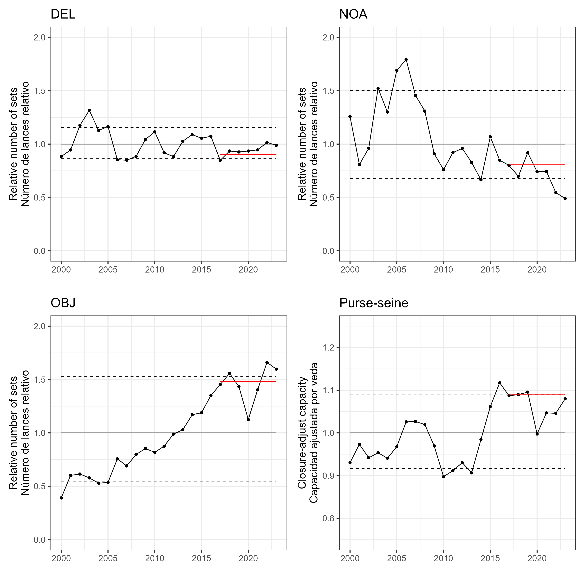
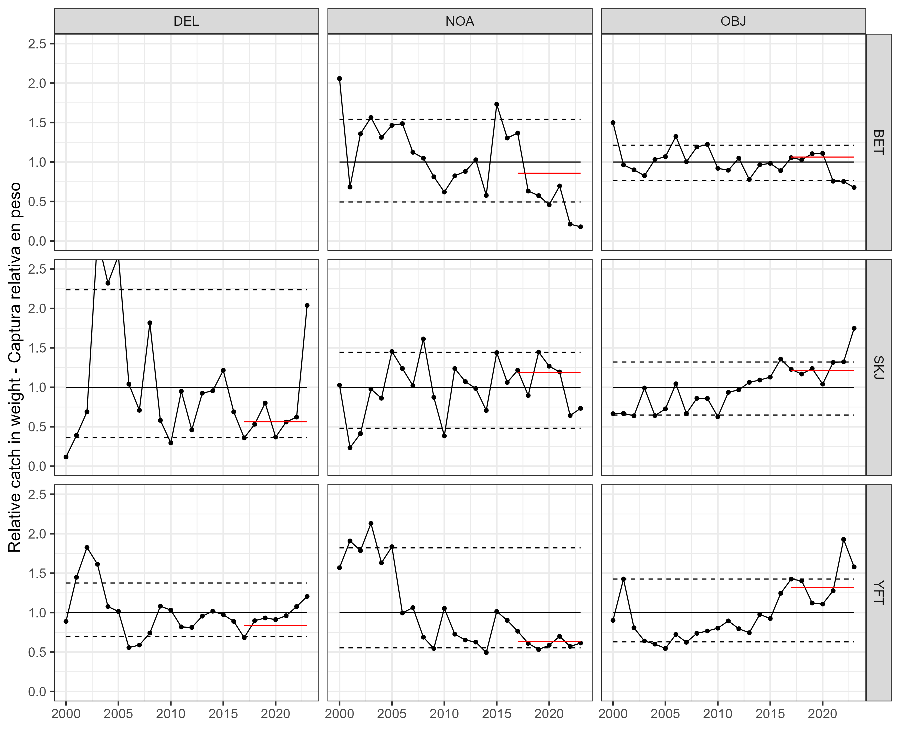
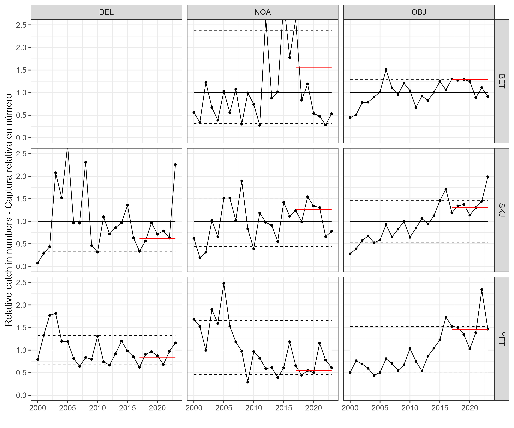
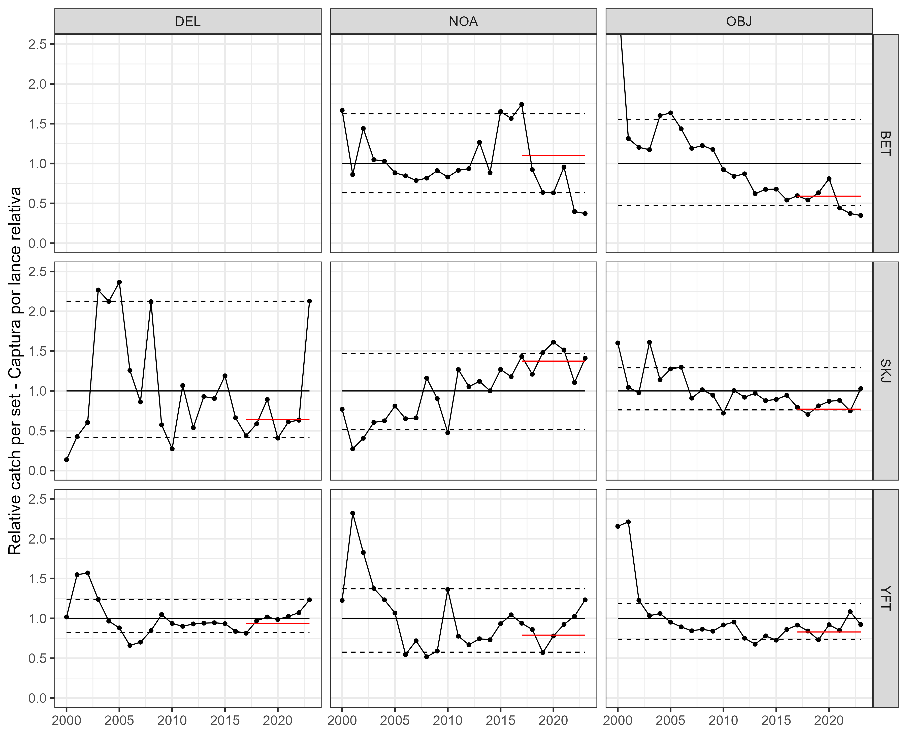
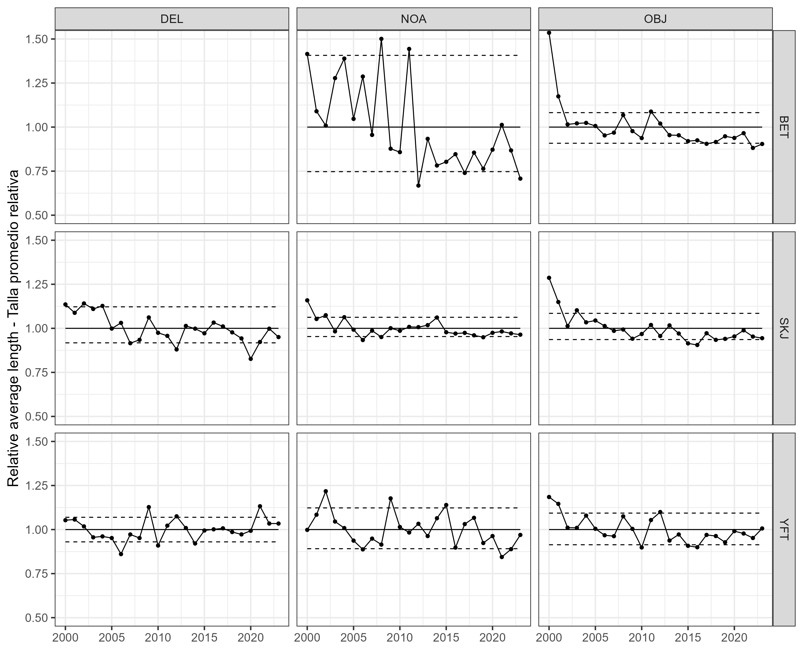

```{r setup, include = FALSE}
year <- 2024
knitr::opts_chunk$set(echo = FALSE, warning = FALSE, message = FALSE)
```

```{r load library}
library(tidyverse)
library(knitr)
library(patchwork)
```

```{r prepare the data table}
dir <- "D:/OneDrive - IATTC/Git/Indicators/2024/data/"

A71 <- read.csv(paste0(dir, "A7_old.csv"))
A72 <- read.csv(paste0(dir, "A7.csv"))

MeanW <- read.csv(paste0(dir, "average_weight.csv"))
MeanW <- MeanW %>% gather(2:9, key = "ST", value = "mean_weight") %>%
  mutate(Species = substr(ST, 1, 3),
         Type = substr(ST, 5, 8))

A7 <- rbind(A71, A72) %>%
  gather(4:6, key = "Species", value = "Catch")

# catch adjustment for 2020 and 2021
A7$Catch[which(A7$Species=="BET"&A7$Year==2020&A7$Type=="OBJ")] <- A7$Catch[which(A7$Species=="BET"&A7$Year==2020&A7$Type=="OBJ")] * (1-12/100)
A7$Catch[which(A7$Species=="BET"&A7$Year==2021&A7$Type=="OBJ")] <- A7$Catch[which(A7$Species=="BET"&A7$Year==2021&A7$Type=="OBJ")] * (1-18.2/100)

A7$Catch[which(A7$Species=="YFT"&A7$Year==2020&A7$Type=="OBJ")] <- A7$Catch[which(A7$Species=="YFT"&A7$Year==2020&A7$Type=="OBJ")] * (1+17.5/100)
A7$Catch[which(A7$Species=="YFT"&A7$Year==2021&A7$Type=="OBJ")] <- A7$Catch[which(A7$Species=="YFT"&A7$Year==2021&A7$Type=="OBJ")] * (1-9.5/100)

A7$Catch[which(A7$Species=="SKJ"&A7$Year==2020&A7$Type=="OBJ")] <- A7$Catch[which(A7$Species=="SKJ"&A7$Year==2020&A7$Type=="OBJ")] * (1-0.6/100)
A7$Catch[which(A7$Species=="SKJ"&A7$Year==2021&A7$Type=="OBJ")] <- A7$Catch[which(A7$Species=="SKJ"&A7$Year==2021&A7$Type=="OBJ")] * (1+6/100)

A7 <- left_join(A7, MeanW) %>%
  filter(!(Type == "DEL" & Species == "BET"), Year > 2001) %>%
  group_by(Type, Species) %>%
  mutate(
    CatchN = Catch / mean_weight,
    CPS = Catch / NSets,
    mean = 1,
    sq = ifelse(abs(Year - 2018) < 2, 1, 0),
    
    Catch2 = Catch / mean(Catch),
    Catch2_low = quantile(Catch2, 0.1),
    Catch2_high = quantile(Catch2, 0.9),
    Catch2_sq = ifelse(Year >= 2017, sum(Catch2 * sq) / 3, NA),
    
    CatchN2 = CatchN / mean(CatchN),
    CatchN2_low = quantile(CatchN2, 0.1),
    CatchN2_high = quantile(CatchN2, 0.9),
    CatchN2_sq = ifelse(Year >= 2017, sum(CatchN2 * sq) / 3, NA),
    
    NSets2 = NSets / mean(NSets),
    NSets2_low = quantile(NSets2, 0.1),
    NSets2_high = quantile(NSets2, 0.9),
    NSets2_sq = ifelse(Year >= 2017, sum(NSets2 * sq) / 3, NA),
    
    CPS2 = CPS / mean(CPS),
    CPS2_low = quantile(CPS2, 0.1),
    CPS2_high = quantile(CPS2, 0.9),
    CPS2_sq = ifelse(Year >= 2017, sum(CPS2 * sq) / 3, NA)
  )
```

```{r Figure 1a}
f1a <- ggplot(data = A7 %>% filter(Type == "DEL")) +
  geom_line(aes(x = Year, y = NSets2)) +
  geom_point(aes(x = Year, y = NSets2)) +
  xlab("") + ylab("Relative number of sets\nNúmero de lances relativo") +
  theme_bw(16) +
  geom_line(aes(x = Year, y = NSets2_low), linetype = "dashed") +
  geom_line(aes(x = Year, y = NSets2_high), linetype = "dashed") +
  geom_line(aes(x = Year, y = mean)) +
  geom_line(aes(x = Year, y = NSets2_sq), color = "red") +
  coord_cartesian(ylim = c(0, 2)) + ggtitle("DEL")
```

```{r Figure 1b}
f1b <- ggplot(data = A7 %>% filter(Type == "NOA")) +
  geom_line(aes(x = Year, y = NSets2)) +
  geom_point(aes(x = Year, y = NSets2)) +
  xlab("") + ylab("Relative number of sets\nNúmero de lances relativo") +
  theme_bw(16) +
  geom_line(aes(x = Year, y = NSets2_low), linetype = "dashed") +
  geom_line(aes(x = Year, y = NSets2_high), linetype = "dashed") +
  geom_line(aes(x = Year, y = mean)) +
  geom_line(aes(x = Year, y = NSets2_sq), color = "red") +
  coord_cartesian(ylim = c(0, 2)) + ggtitle("NOA")
```

```{r Figure 1c}
f1c <- ggplot(data = A7 %>% filter(Type == "OBJ")) +
  geom_line(aes(x = Year, y = NSets2)) +
  geom_point(aes(x = Year, y = NSets2)) +
  xlab("") + ylab("Relative number of sets\nNúmero de lances relativo") +
  theme_bw(16) +
  geom_line(aes(x = Year, y = NSets2_low), linetype = "dashed") +
  geom_line(aes(x = Year, y = NSets2_high), linetype = "dashed") +
  geom_line(aes(x = Year, y = mean)) +
  geom_line(aes(x = Year, y = NSets2_sq), color = "red") +
  coord_cartesian(ylim = c(0, 2)) + ggtitle("OBJ")
```

```{r Figure 1d}
A10 <- read.csv(paste0(dir, "A10.csv"))

A10 <- A10 %>%
  mutate(
    Capacity = Capacity / mean(Capacity),
    Capacity_low = quantile(Capacity, 0.1),
    Capacity_high = quantile(Capacity, 0.9),
    mean = 1,
    sq = ifelse(abs(Year - 2018) < 2, 1, 0),
    Capacity_sq = ifelse(Year >= 2017, sum(Capacity * sq) / 3, NA)
  )

f1d <- ggplot(data = A10) +
  geom_line(aes(x = Year, y = Capacity)) +
  geom_point(aes(x = Year, y = Capacity)) +
  theme_bw(16) +
  geom_line(aes(x = Year, y = Capacity_low), linetype = "dashed") +
  geom_line(aes(x = Year, y = Capacity_high), linetype = "dashed") +
  geom_line(aes(x = Year, y = mean)) +
  geom_line(aes(x = Year, y = Capacity_sq), color = "red") +
  xlab("") + ylab("Closure-adjust capacity\nCapacidad ajustada por veda") +
  coord_cartesian(ylim = c(0.75, 1.25)) + ggtitle("Purse-seine")
```

```{r Figure 1}
ggsave((f1a + f1b) / (f1c + f1d),
       file = "Figure1.pdf",
       height = 12,
       width = 12
)
ggsave((f1a + f1b) / (f1c + f1d),
       file = "Figure1.png",
       height = 12,
       width = 12
)
```

```{r Figure 2a}
f2a <- ggplot(data = A7) +
  geom_line(aes(x = Year, y = Catch2)) +
  geom_point(aes(x = Year, y = Catch2)) +
  geom_line(aes(x = Year, y = Catch2_low), linetype = "dashed") +
  geom_line(aes(x = Year, y = Catch2_high), linetype = "dashed") +
  geom_line(aes(x = Year, y = mean)) +
  geom_line(aes(x = Year, y = Catch2_sq), color = "red") +
  facet_grid(Species ~ Type) +
  theme_bw(16) +
  coord_cartesian(ylim = c(0, 2.5)) +
  xlab("") + ylab("Relative catch in weight - Captura relativa en peso")

ggsave(f2a,
       file = "Figure2a.pdf",
       height = 10,
       width = 12)
ggsave(f2a,
       file = "Figure2a.png",
       height = 10,
       width = 12)
```

```{r Figure 2b}
A7_catchN <- A7 %>%
  filter(!(Type == "DEL" & Species == "BET"))

A7_catchN <- left_join(A7_catchN, MeanW) %>%
  mutate(CatchN = Catch / mean_weight) %>%
  group_by(Species, Type) %>%
  mutate(
    Catch2 = CatchN / mean(CatchN),
    Catch2_low = quantile(Catch2, 0.1),
    Catch2_high = quantile(Catch2, 0.9),
    Catch2_mean = 1,
    sq = ifelse(abs(Year - 2018) < 2, 1, 0),
    Catch2_sq = ifelse(Year >= 2017, sum(Catch2 * sq) / 3, NA)
  )

f2b <- ggplot(data = A7_catchN) +
  geom_line(aes(x = Year, y = Catch2)) +
  geom_point(aes(x = Year, y = Catch2)) +
  geom_line(aes(x = Year, y = Catch2_low), linetype = "dashed") +
  geom_line(aes(x = Year, y = Catch2_high), linetype = "dashed") +
  geom_line(aes(x = Year, y = Catch2_mean)) +
  geom_line(aes(x = Year, y = Catch2_sq), color = "red") +
  facet_grid(Species ~ Type) +
  theme_bw(16) +
  coord_cartesian(ylim = c(0, 2.5)) +
  xlab("") + ylab("Relative catch in numbers - Captura relativa en número")

ggsave(f2b,
       file = "Figure2b.pdf",
       height = 10,
       width = 12)
ggsave(f2b,
       file = "Figure2b.png",
       height = 10,
       width = 12)
```

```{r Figure 3}
f3 <- ggplot(data = A7) +
  geom_line(aes(x = Year, y = CPS2)) +
  geom_point(aes(x = Year, y = CPS2)) +
  geom_line(aes(x = Year, y = CPS2_low), linetype = "dashed") +
  geom_line(aes(x = Year, y = CPS2_high), linetype = "dashed") +
  geom_line(aes(x = Year, y = mean)) +
  geom_line(aes(x = Year, y = CPS2_sq), color = "red") +
  facet_grid(Species ~ Type) +
  theme_bw(16) +
  coord_cartesian(ylim = c(0, 2.5)) +
  xlab("") + ylab("Relative catch per set - Captura por lance relativa")

ggsave(f3,
       file = "Figure3.pdf",
       height = 10,
       width = 12)
ggsave(f3,
       file = "Figure3.png",
       height = 10,
       width = 12)
```

```{r Figure 4}
MeanL <- read.csv(paste0(dir, "average_length.csv"))

MeanL <- MeanL %>% filter(Year > 2001) %>%
  gather(2:9, key = "ST", value = "Length") %>%
  mutate(Species = substr(ST, 1, 3),
         Type = substr(ST, 5, 8)) %>%
  group_by(Species, Type) %>%
  mutate(
    Length2 = Length / mean(Length),
    length_low = quantile(Length2, 0.1),
    length_high = quantile(Length2, 0.9),
    length_mean = 1
  )

f4 <- ggplot(data = MeanL) +
  geom_line(aes(x = Year, y = Length2)) +
  geom_point(aes(x = Year, y = Length2)) +
  geom_line(aes(x = Year, y = length_low), linetype = "dashed") +
  geom_line(aes(x = Year, y = length_high), linetype = "dashed") +
  geom_line(aes(x = Year, y = length_mean)) +
  facet_grid(Species ~ Type) +
  theme_bw(16) +
  coord_cartesian(ylim = c(0.5, 1.5)) +
  xlab("") + ylab("Relative average length - Talla promedio relativa")

ggsave(f4,
       file = "Figure4.pdf",
       height = 10,
       width = 12)
ggsave(f4,
       file = "Figure4.png",
       height = 10,
       width = 12)
```

# Figures

 <br>\
Figure 1

 <br>\
Figure 2a

 <br>\
Figure 2b

 <br>\
Figure 3

 <br>\
Figure 4